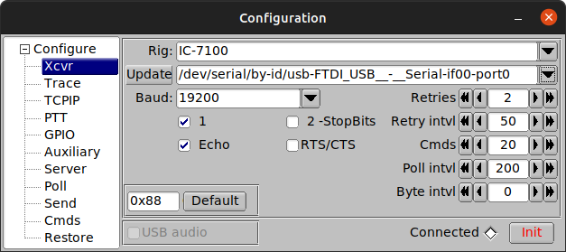
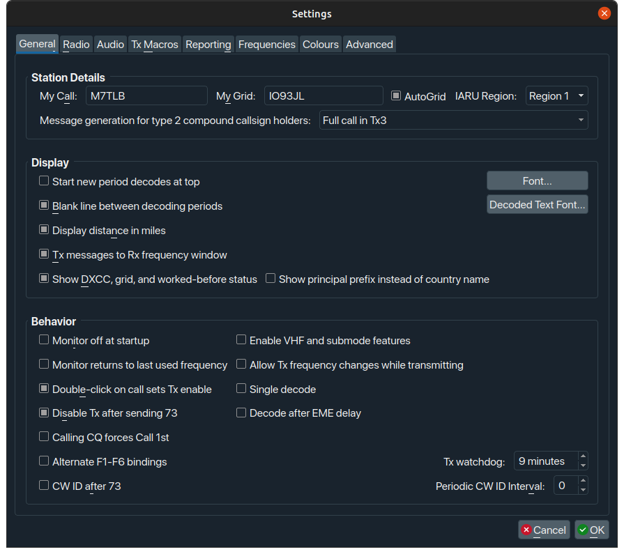
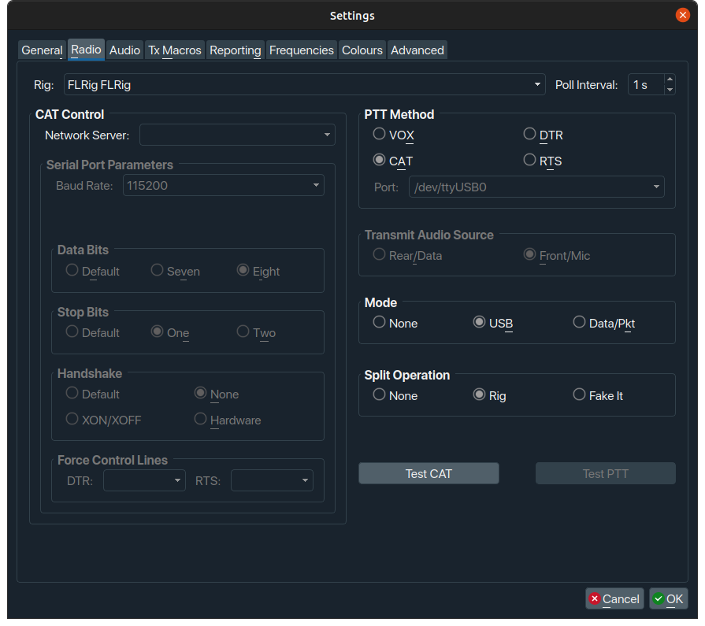
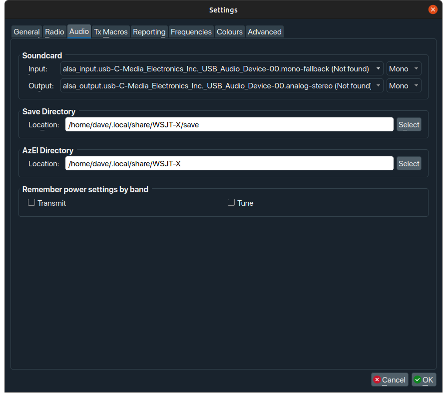
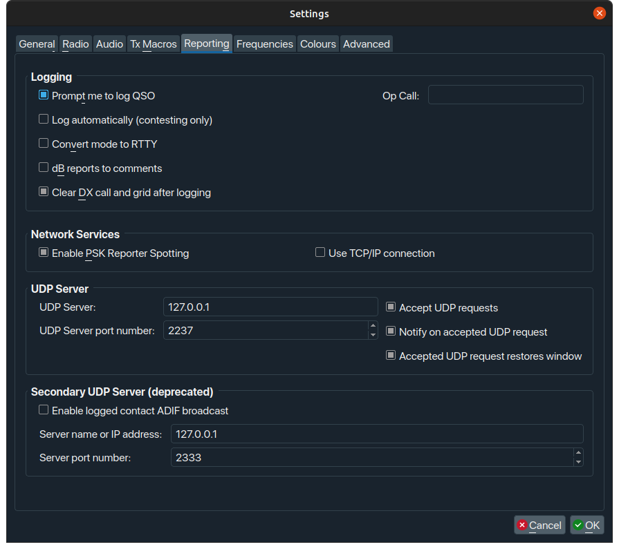

!!! information
    This article was written by operator [Dave M7TLB][QRZ], for the Amateur Radio community.

    Reach out to me via [QRZ][QRZ] for any additions and omissions.

[QRZ]: https://qrz.com/db/M7TLB


!!! warning
    This document is a work in progress, and therefore may be utter bobbins.

## Overview

This document details the process for setting up FT8 on Linux, specifically for the Xiegu G90 transceiver.  However, you can probably use this for any transceiver, but your mileage may vary.

## The software

In order to get running with FT8 under Linux, you need the following software:

* **WSJT-X** - this is the key part of the whole affair, and does the majority of the heavy lifting.
* **flrig** - this is part of the FlDigi suite of programs.  You may not require this if you're not using a G90, but actually it seems like a pretty decent piece of kit even if you are.  This helps interface between the rig and WSJT-X.
* **Gridtracker** - absolutely not a requirement - at all - however if you want your FT8 QSOs to be automatically logged to wherever your logbook is (mine is Cloudlog), then this saves a bunch of time.

I'm going to address these in the order which seems the most logical to me.

### flrig

You can get the `flrig` source code from [SourceForge][flrig] but - if you're a Ubuntu user like myself - you may be able to install it directly from the standard repositories:

```shell
sudo apt install flrig
```

Debian and other distro users may also have some success with this.  However, with most package managers, you may not be using the most up-to-date version.  On SourceForge, the latest version is 1.4.5, but in the repositories for Ubuntu 20.04 (at the time of writing this) it's 1.3.53.  That said, it just works.

When you run `flrig` for the first time, you may get thrown straight into the configuration window, if not, go to Config, Setup, Transceiver.

> At this point, you need to have your rig powered up, with antenna connected, with the interface cable connected between the G90 (bottom connector on the left hand side of the display) and your PC.

This is how you want the configuration to be set up:



* **Rig:** I had to set up my rig as the Icom IC-7100, as there was no option for the Xiegu G90, however you may actually find the G90 listed.  If you do, choose that.
* **Update**: In this drop-down, you should select the FTDI cable that came with the G90.  If you can't see your cable listed (and the name should be similar to the screenshot above) then you may need to make a couple of changes to your system to accommodate.  
??? question "What if I can't see my interface cable?"

    You may need to add yourself to the `dialout` group to be able to use the interface cable correctly.

    ```shell
    sudo usermod -a -G dialout yourusername
    ```

    Test that it's worked:

    ```shell
    cat /etc/group | grep dialout  
    ```

    You should see `dialout` at the start of the resulting line, and *`yourusername`* (your actual username, not literally "yourusername") somewhere at the end of the line.

    You will need to reboot to get this working properly.  I did try logging off and on again but that didn't work for me.  You can always try that first if you're more comfortable with that.
* **Baud**: Should be set to 19200
* Make sure all other checks and values are set as per the screenshot.
* Click the \[Init] button.  If all goes well, the Connected diamond will turn green, and the `flrig` interface should now mirror the information on the G90.  You can test this by rolling the scroll wheel over the left-hand frequency display within `flrig` itself, to change the frequency, and your G90 should follow.

**If everything is working as described, you can minimise `flrig` and carry on with the WSJT-X**

### WSJT-X

You can get the WSJT-X source code and binary packages from [K1JT's website][wsjtx] but again you may be able to install it directly from the standard repositories:

```shell
sudo apt install wsjtx
```

Same caveat as before on using your distro's repos.  On the official WSJT-X website, the latest version is 2.5.4, but in the repositories for Ubuntu 20.04 (at the time of writing this) it's 2.4.0.  As before, it does just work.

When you run WSJT-X for the first time, you may get thrown straight into the configuration window (possibly after an error), if not, go to File, Settings...

!!! information

    At this point, you need to have your rig powered up, with a suitable soundcard on your PC, with audio cables running from the soundcard to whichever adapter you're using to connect to your G90.  I'm using the offical Xiegu CE-19 adapter.

    **TODO**: document audio connection from CE-19/DE-19 to soundcard

In the Configuration settings, you'll want things to look like this:

=== "General"

    

    * Make sure you put your own callsign, Grid Locator code, and IARU Region in the top line.
    * You might also want to set the checkboxes the same way I have.  These work for me, your mileage may vary.  Experiment at your own risk, as always.

=== "Radio"

    

    * The key thing here is to select "FLRig FLRig" from the Rig drop-down.  This tells WSJT-X to use the `flrig` software that's running in the background as its radio.
    * Set the remaining three values - PTT Method, Mode, Split Operations - as shown.
    * Once you've set the values as shown, click the \[Test CAT] button... it should go green.
    * Then, **as long as you have a tuned or resonant antenna attached**, click \[Test PTT] - toggle on, toggle off.  This should key and un-key your radio.

=== "Audio"

    

    * The key thing here is to ensure that your soundcard is set correctly to whatever sound device or dongle you're using.  I would *strongly* recommend the use of a cheapo USB audio dongle.

    !!! information
        **TODO**: mention the audio connection documentation here

    > *Ignore the (not found) message... it's because the dongle wasn't plugged in when I took those screenshots.*

=== "Reporting"

    

    * Set the values as per this screenshot.  These work for me, your mileage may vary.  Experiment at your own risk, as always.
    * The UDP Server settings will support the set-up of Gridtracker a little later on.

[flrig]: https://sourceforge.net/projects/fldigi/files/flrig/
[wsjtx]: https://www.physics.princeton.edu/pulsar/K1JT/wsjtx.html
